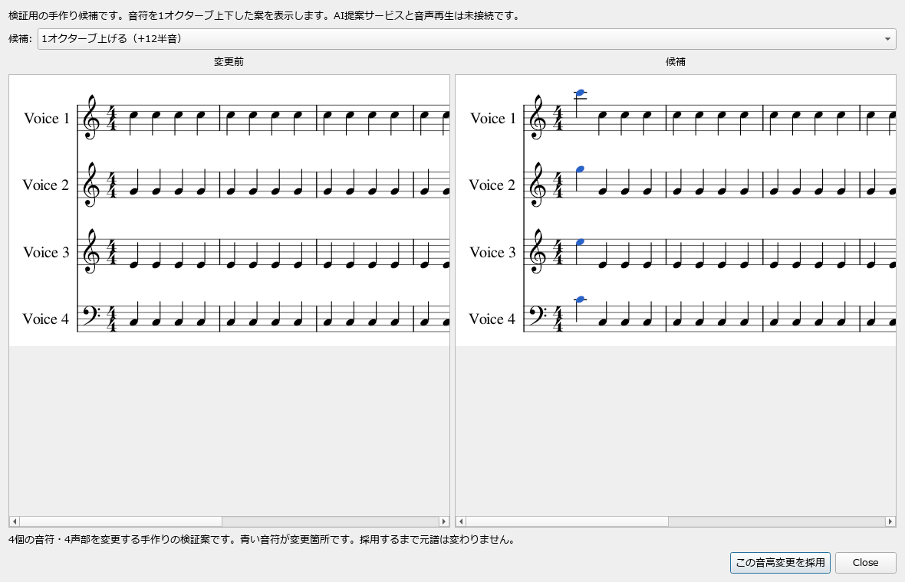

# 楽譜の候補プレビュー — 最初の試作

楽譜についてAIと相談し、発想を検討して、候補を譜面と音で比較・採用できる制作環境を目指しています。この変更では、その土台になる「元譜を保ったまま別案を表示し、選んだ変更を一度に採用・Undoする」流れを実装しています。

基準はMuseScore v4.7.5、コミット `3654226c2e99289916916953a98e585a3d3b315a` です。個人用forkの試作として、対応する記譜を絞って検証しています。アカペラは最初の利用例で、製品全体の編成・用途や編集区間の長さを固定するものではありません。

## 使い方

1. このブランチからビルドしたMuseScoreで、フルスコアを開きます。検証用の譜面は [four-parts.mscx](../../src/engraving/tests/previewproject_data/four-parts.mscx) です。
2. 変更したい音符を選択し、ツールメニューの **Compare pitch alternatives…** を開きます。未選択の場合は、先頭小節の各声部にある通常の単音が対象になります。
3. 左側に元譜、右側に候補が表示されます。候補欄で **1オクターブ上げる／下げる** を切り替えます。変更した音符は青色になります。
4. **この音高変更を採用** を押すと、検証した音高変更を元譜にまとめて反映します。**Close** で閉じた場合は採用しません。
5. 採用後も比較画面は表示されたままです。**Close** を押して元譜へ戻り、**Ctrl+Z** で全変更を一度に戻せます。Redoで復元できます。

現在の候補は、既存の音符を1オクターブ上下する手作りの検証案です。MuseScore内のAI対話、AIによる候補生成、原案と候補の試聴はまだ接続していません。



画像は、検証用4声譜を使って実際のQt Widgets画面をoffscreenで描画したものです。

## 変更の構成

| 部分 | 役割 |
|---|---|
| `MasterScore::createPreviewProject()` | 専用の書出しモードを使い、元譜と所有権・音符・Undoを共有しない候補プロジェクトを作ります。通常保存で更新する元譜のID、表示状態、メタデータ等をプレビュー作成時に変更しないようにします |
| `applyPreviewPitchChanges()` | 変更区間・声部・位置・元の音高・変更後の音高を全件確認し、有効な変更だけを一つのUndo操作として反映します。不正な項目があれば全件を拒否します |
| `PitchPreviewDialog` | 元譜と候補を本体の描画機構で並べ、候補切替・変更箇所の表示・採用・破棄を行います。元譜の変更後や別プロジェクトへの切替後は古い候補を採用しません |
| 追加テスト | 候補の独立性、元譜の不変、全件検査、一括Undo／Redo、保存・再読込、画面描画と候補切替を確認します |

## 検証した範囲

2026年10月5日にWindowsで確認した内容です。

- アプリのコンパイル・リンク・実行用データ配置が成功しました。バージョン表示、offscreenでのアプリ起動、検証用譜面の読込・PNG書出しも確認しました。
- 追加した候補処理のテスト **12件** が成功しました。独自のコード記号の表示と定義の独立性、通常保存でIDを省略する設定下でも候補のシステムロックを保持することも確認しました。
- 追加した比較画面の統合テスト **5件** が成功しました。実際に見えている領域の譜面と青い変更音符、上下候補の切替、採用とUndo／Redo、閉じた場合の元譜・履歴の不変、装飾音を含む選択の拒否を確認しました。別プロジェクトや別の譜面へ切り替えてから元へ戻っても、古い候補を採用できないことを通知のモックで確認しました。
- 関連する既存テスト **46件** のテスト判定が成功しました。ただし既存の `createAndSaveLocks` は内部の比較用パスエラーを無視しているため、その比較の成功は検証結果に含めません。追加したテストではシステムロックの境界を直接確認しています。無効化されている既存テスト2件は実行数に含めません。
- レビューで追加した回帰テスト **4件** は、修正前に不具合を再現して失敗し、修正後に成功することを確認しました。CIの固定版Uncrustify 0.74.0と同じ設定による変更C++ファイル22件の規約検査、`git diff --check` も成功しました。

Windowsの通常画面での手動操作・音声確認、他のOS、全テストの実行、GitHub上のCIは未確認です。画面テストではプロジェクト・譜面・通知をモックしているため、実画面での保存状態表示・譜面切替、反映途中に失敗した場合の巻戻しは別途確認が必要です。試作全体の完成判定や、AI提案の音楽的な品質を確認した結果ではありません。

### ビルドとテストの入口

確認時はVisual Studio 2022のC++ツール、Windows SDK 10.0.26100.0、Qt 6.10.2、CMake 3.31.10を使いました。Qtは `qt5compat`、`qtshadertools`、`qtnetworkauth` とprivateヘッダーを含む構成です。QtとコンパイラーはMuseScore本体のビルド環境として設定します。

既存のCMakeビルドディレクトリで `MUSE_ENABLE_UNIT_TESTS=ON`、`MUE_BUILD_ENGRAVING_TESTS=ON`、`MUE_BUILD_NOTATIONSCENE_TESTS=ON` を有効にし、次のターゲットをビルドします。`<build-dir>` は自分のビルド先に置き換えます。

```text
cmake --build <build-dir> --config Release --target engraving_tests notationscene_widget_tests
```

WindowsではQtの `bin` をPATHに追加し、ビルド先の `Release` ディレクトリにある実行ファイルを、ソース管理されていない作業ディレクトリから実行します。関連する既存テストのファイル比較にはGitの `usr/bin` にある `diff` もPATHに必要です。比較画面テストは直接実行した場合もoffscreenを使用します。

```text
engraving_tests.exe --gtest_filter=Engraving_PreviewProjectTests.*
notationscene_widget_tests.exe
```

関連する既存テストの実行対象は次のフィルターです。

```text
Engraving_MsczFileTests.*:Engraving_EIDTests.*:Engraving_ReadWriteUndoResetTests.*:Engraving_LinksTests.*:Engraving_SystemLocksTests.*:Engraving_NoteTests.*:Engraving_ChordSymbolTests.*
```

アプリの確認では、翻訳ターゲット `translations` を作成してから `MuseScoreStudio` をビルドしました。Windowsの長い生成ファイル名でエラーが出たため、ビルドディレクトリの `Directory.Build.targets` に次の設定を置きました。この設定は生成される状態ファイル名を短くするだけで、ソースの変更やOS設定の変更は不要です。

```xml
<Project>
  <Target Name="ShortBuildStatePath" BeforeTargets="PrepareForBuild">
    <PropertyGroup>
      <LastBuildState>$(TLogLocation)state.lastbuildstate</LastBuildState>
    </PropertyGroup>
  </Target>
</Project>
```

## 制限と次の段階

現在は通常の単音の音高変更が対象です。複音和音、タイ、リンク音符、装飾音、打楽器、タブ譜は拒否します。休符と音符の入替、音価・歌詞の変更、パート譜からのプレビューは未実装です。

比較画面はダイアログ方式です。通常の譜面入力と同時に使う流れ、外部音源・ミキサー設定・再生状態を含むプロジェクト全体の複製は未検証です。

次は原案と候補の同区間試聴、AIとの対話、共通の構造化提案をこの仕組みに接続します。AIへの通信・認証と譜面の検証・比較・採用を分離し、最初は既存のChatGPT／Codex契約を使う経路を優先します。将来Claude等へ切り替えられる設計を維持します。AI接続の外部実験コードはこの変更に含めていません。
